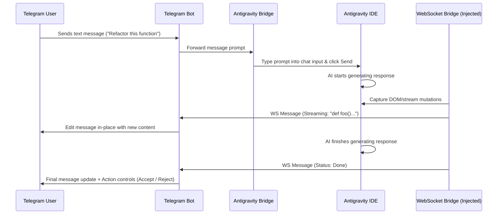

# Architecture Overview

AntiBridge provides a bridge between Telegram and the Antigravity IDE. It allows developers to control and interact with their local AI assistant inside the IDE from anywhere via a Telegram chatbot interface.

```
+------------------+         +------------------+         +------------------+
|                  |  HTTP   |                  |  CDP   |                  |
|  Telegram Client | <=====> |  Telegram Server | <====> | Antigravity IDE  |
|                  |  Poll   |  (Node.js App)   | (Port) |  (Chrome/CDP)    |
+------------------+         +------------------+         +------------------+
                                      ^                            ^
                                      | WebSocket                  | Injected Script
                                      v                            |
                             +------------------+                  |
                             |  chat_bridge_ws  | <================+
                             |  (WebSocket WS)  |
                             +------------------+
```

## Key Components

### 1. Backend Server (`backend/telegram-server.js`)
- The main execution coordinator. It launches an Express and WebSocket server (typically running on port `8000`).
- Integrates the Telegram Bot client (`TelegramBot.js`) and initializes the Chrome DevTools Protocol connection bridge (`AntigravityBridge.js`).

### 2. Antigravity Bridge (`backend/services/AntigravityBridge.js`)
- Connects to the Antigravity IDE's Chromium engine using **Puppeteer Core** (or standard CDP) via port `9000`.
- Scans active web page frames inside the IDE to find the AI Chat interface.
- Automatically injects scripts into the IDE to hook into internal chat interfaces, button states, and terminal panels.
- Exposes remote automation actions such as clicking buttons (Accept/Reject), writing prompt messages, switching models, capturing screenshots, and browsing workspace files.

### 3. Injected WebSocket Client (`scripts/chat_bridge_ws.js`)
- Once the bridge connects, it injects `chat_bridge_ws.js` into the IDE frame.
- This script establishes a local WebSocket connection back to the backend server (`ws://localhost:8000`).
- It intercepts DOM mutations and network requests within the IDE to capture thinking logs, streamed AI answers, and conversation updates.
- It translates internal IDE states into structured WebSocket events sent directly to the Telegram bot, which updates the Telegram chat in real-time.

### 4. Quota Monitor (`backend/services/QuotaService.js`)
- Periodically runs lightweight scripts inside the IDE's frame to extract active AI token quotas and usage percentages.
- Compares current quotas with previous history to detect changes.
- Logs changes to `quota_history.json` and alerts the user on Telegram only when usage increases or decreases.

### 5. Telegram Bot Controller (`backend/services/TelegramBot.js`)
- Listens to Telegram bot updates (incoming messages, button clicks, slash commands).
- Employs **single-message updates** (in-place edits of Telegram messages) to stream AI responses in real-time without flooding the user's chat history.
- Uses inline keyboards to provide easy access to commands like swapping models, listing conversations, navigating directories, running workflows, or accepting/rejecting IDE actions.

---

## Message Flow Diagram



## Injection and Protocol Methods
- **CDP (Chrome DevTools Protocol)**: Port `9000` is opened on the IDE's Chromium engine. We connect to it using a debugging client to inspect DOM nodes and run evaluations.
- **WebSocket Bridge**: Bypasses traditional polling limits. Instead of polling the IDE's DOM every few seconds, we hook directly into mutations and WebSocket-like actions to achieve latency-free updates.
