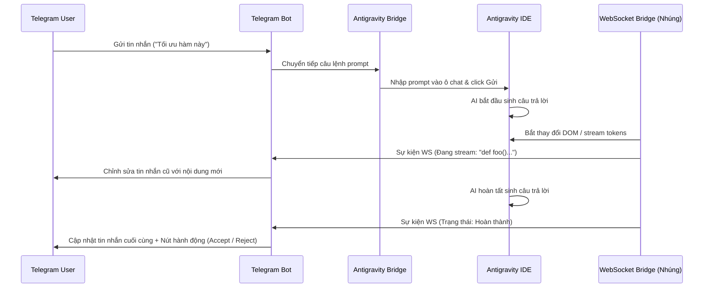

# Tổng Quan Kiến Trúc

AntiBridge đóng vai trò là một cầu nối trung gian giữa ứng dụng Telegram và Antigravity IDE. Nó cho phép lập trình viên điều khiển và tương tác với trợ lý AI cục bộ bên trong IDE từ bất cứ đâu thông qua giao diện chatbot Telegram.

```
+------------------+         +------------------+         +------------------+
|                  |  HTTP   |                  |  CDP   |                  |
|  Telegram Client | <=====> |  Telegram Server | <====> | Antigravity IDE  |
|                  |  Poll   |  (Node.js App)   | (Port) |  (Chrome/CDP)    |
+------------------+         +------------------+         +------------------+
                                      ^                            ^
                                      | WebSocket                  | Injected Script
                                      v                            |
                             +------------------+                  |
                             |  chat_bridge_ws  | <================+
                             |  (WebSocket WS)  |
                             +------------------+
```

## Các Thành Phần Chính

### 1. Máy Chủ Backend (`backend/telegram-server.js`)
- Điều phối toàn bộ hoạt động. Nó khởi chạy một máy chủ Express và WebSocket (thường chạy trên cổng `8000`).
- Tích hợp bot client Telegram (`TelegramBot.js`) và khởi tạo cổng kết nối Chrome DevTools Protocol (`AntigravityBridge.js`).

### 2. Antigravity Bridge (`backend/services/AntigravityBridge.js`)
- Kết nối tới nhân Chromium của Antigravity IDE bằng cách sử dụng **Puppeteer Core** (hoặc giao thức CDP chuẩn) thông qua cổng debug `9000`.
- Quét các khung trang (frames) đang hoạt động bên trong IDE để tìm giao diện AI Chat.
- Tự động nhúng (inject) mã Javascript vào IDE để móc nối (hook) vào giao diện chat nội bộ, trạng thái nút bấm và bảng điều khiển terminal.
- Cung cấp các hàm tự động hóa từ xa như click nút (Accept/Reject), nhập câu lệnh prompt, đổi model, chụp ảnh màn hình và duyệt tệp tin thư mục dự án.

### 3. Nhúng WebSocket Client (`scripts/chat_bridge_ws.js`)
- Ngay khi Bridge kết nối thành công, nó sẽ nhúng mã script `chat_bridge_ws.js` vào frame của IDE.
- Script này thiết lập một kết nối WebSocket nội bộ ngược trở lại máy chủ backend (`ws://localhost:8000`).
- Nó giám sát các thay đổi DOM (DOM mutations) và các yêu cầu mạng trong IDE để bắt log suy nghĩ (thinking process), câu trả lời AI đang stream và cập nhật cuộc hội thoại.
- Nó dịch các trạng thái IDE nội bộ thành các sự kiện WebSocket gửi trực tiếp tới Telegram bot để cập nhật tin nhắn theo thời gian thực.

### 4. Giám Sát Quota (`backend/services/QuotaService.js`)
- Định kỳ chạy các script tối giản bên trong IDE frame nhằm trích xuất hạn mức sử dụng (token quota) và phần trăm đã dùng của các model AI.
- So sánh hạn mức hiện tại với lịch sử trước đó để phát hiện thay đổi.
- Lưu trữ dữ liệu lịch sử vào `quota_history.json` và chỉ gửi cảnh báo qua Telegram khi lượng sử dụng có sự biến động (tăng/giảm).

### 5. Điều Khiển Telegram Bot (`backend/services/TelegramBot.js`)
- Nhận các cập nhật từ Telegram bot (tin nhắn gửi đến, click nút bấm inline, lệnh slash).
- Áp dụng cơ chế **cập nhật trên một tin nhắn duy nhất** (chỉnh sửa nội dung tin nhắn cũ trực tiếp) để stream câu trả lời của AI theo thời gian thực mà không làm tràn (spam) lịch sử trò chuyện.
- Sử dụng các bàn phím inline (inline keyboard) để người dùng dễ dàng đổi model, xem danh sách cuộc hội thoại, duyệt cây thư mục, chạy workflow hoặc chấp nhận/từ chối (Accept/Reject) các thay đổi mã nguồn trong IDE.

---

## Biểu Đồ Luồng Tin Nhắn



## Các Phương Thức Nhúng và Giao Thức
- **CDP (Chrome DevTools Protocol)**: Cổng `9000` được mở trên Chromium engine của IDE. Chúng ta kết nối qua đó để duyệt cây DOM và chạy mã Javascript tùy ý.
- **WebSocket Bridge**: Bỏ qua các giới hạn của cơ chế thăm dò (polling) truyền thống. Thay vì liên tục quét DOM sau mỗi vài giây, chúng ta lắng nghe trực tiếp các sự kiện thay đổi dữ liệu để cập nhật tức thì với độ trễ bằng 0.
